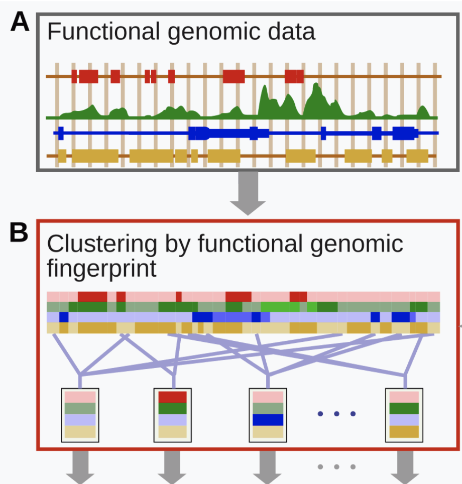
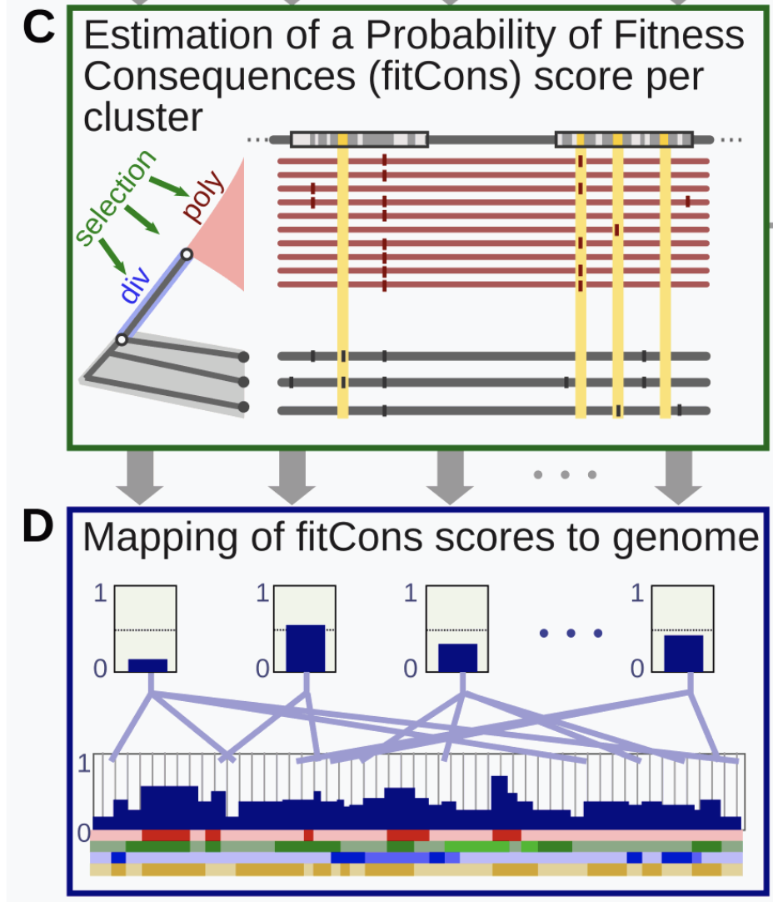

# fitCons

The fitness consequences of functional annotation, integrates functional assays (such as ChIP-Seq) with selective pressure inferred using the INSIGHT method. The result is a score ρ in the range [0.0-1.0] that indicates the fraction of genomic positions evincing a particular pattern (or "fingerprint") of functional assay results, that are under selective pressure. As these scores show the selective pressure consequences of patterns of functional genomic assays, they can vary per cell-type just as functional assays do. Scores combine conservative and adaptive selective pressures and may be used an a relative indicator of the potential for interesting genomic function, with higher scores indicating more potential.

## Calculating The fitCons Score

**Covariate Selection**

Four covariates (A) are obtained for each cell type: DNase I peaks, Normalized RNA-Seq Read Depth (RPM), Chromatin State (ChromHMM class) and GENCODE annotation as protein coding CDS. The last of these is common to all cell types. Each data set is then quantized into as small number of classes (B), assigning each position in the genome, one class, from each data set.

* DNase I HS Peaks: 2-Narrow Peak, 1-Broad Peak (and not Narrow Peak), and 0-No Peak
* RNA-Seq Read Depth: 3-High Depth, 2-Medium Depth, 1-Low Depth, and 0-No Signal
* CDS Annotation: 1-Annotated as CDS, or 0-Not Annotated
* Chromatin State: [1-25] Chrom HMM class assigned to that position, or 26-No Class available.

This generates a total of 3x4x2x26=624 unique "fingerprints" with each genomic position evincing exactly one finger print in each cell-type (B). All positions associated with a particular fingerprint are grouped together into a common functional class.

## Evolutionary Genomic Data

Selective pressure for each functional class is inferred (C) from the distribution of human polymorphism and primate divergence, relative to nearby neutrally evolving loci. Human polymorphism data is drawn from position-wise variation among 54 unrelated human individuals from the [69 sequences released by Complete Genomics](https://www.completegenomics.com/public-data/69-Genomes/). Divergence data is derived from an the most recent common ancestor of Human and Chimpanzee, which is inferred using Chimpanzee (panTro2), Orangutan (ponAbe2), and rhesus Macaque (rheMac2) reference genomes. Putative neutral loci are identified by removing a window around known conserved and protein coding genomic positions, as well as a number of technically undesirable genomic positions (such as unmappable regions).

## Applying INSIGHT

INSIGHT was applied (C) to infer a maximum likelihood estimate of the fraction of genomic positions under selective pressure (ρ) for each of the 624 functional classes. This calculation was performed separately for each cell type. The fitCons score associated with a functional class, was then assigned to all genomic positions in that class (D). A curvature based method was employed to identify the standard error in for each estimate and only classes with a standard error of less than .4xρ were considered in the published analysis.

Information from http://compgen.cshl.edu/fitCons/